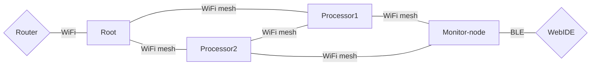

# Wasm-ESP-IDF-Mesh-Demo
A data stream processing with WebAssembly over mesh network for ESP MCUs. ESPs build a mesh network, and a node processes data with WebAssembly and transmits results to other members. This implementation employs three node types: root node, processor, and monitor node.
- **Root node**: This node is connected with a router and has a role of bridge between its mesh network and external networks. Also, WASM module can be executed on this node.
- **Processor node**: Nodes that get, process, and forward data. A WASM module processes data.
- **Monitor node**: This node is an access point for monitoring mesh network. By using the [Web IDE](https://wasm-ide.herokuapp.com/ide.html), one can connect the browser with this node and monitor the network via BLE. Due to the memory limitation, simultaneous execution of MESH, BLE, and WASM causes a crash. Therefore, this node does NOT have the WASM runtime.
## Example network

## Installation Instructions
### Prerequisites
- Installation with [Platform IO IDE for VSCode](https://docs.platformio.org/en/stable/integration/ide/vscode.html) is recommended. 
- This prototype uses [ESP-WIFI-MESH](https://docs.espressif.com/projects/esp-idf/en/stable/esp32/api-guides/esp-wifi-mesh.html) and create a fixed-root mesh network, therefore, a router is necessary. 
- At least three ESP boards are required for the root, processor, and monitor node.
- Exactly one ESP MCU must be the root node.

### PIO setting
Check your ESP board and edit `platformio.ini`

### Configuration
- In `main.c` for only root node, set your router's SSID and password
- The default max. number of data stream distination is TWO. To change this, set new MESH_DATA_STREAM_TABLE_LEN (number of destinations * 6) for target nodes

### Upload
Make sure that your board is connected and PIO destinates the corresponding port. After build and upload the program to the MCU, a sample WASM file `main.wasm` also has to be uploded. You find this operation button under `Project task -> <board name> -> platform -> upload file system image` in the PIO menu.

## Web IDE
- A prototype of web IDE is available here: https://wasm-ide.herokuapp.com/ide.html
- Source code and instruction for UI: https://github.com/Ayato77/Wasm-ble-web-ide
